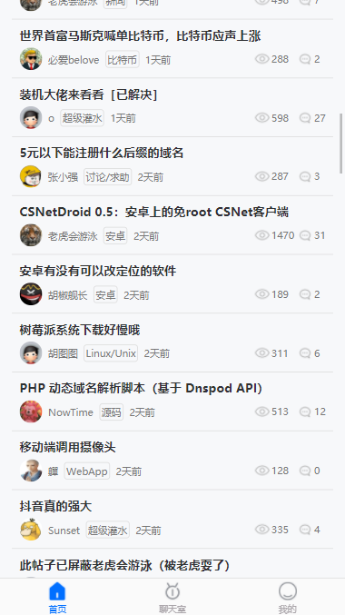
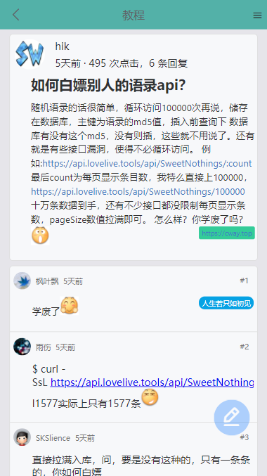
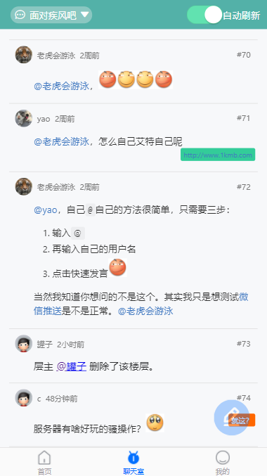
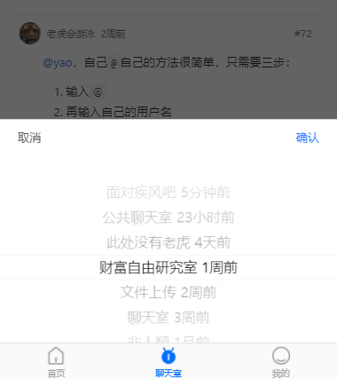

# hu60-jhtml-uniapp

使用`uni-app`重构[原项目](https://github.com/iola1999/hu60-jhtml/tree/master)。

## 部分截图：

  

  

## 计划的开发顺序

- [x] 首页帖子列表
- [x] 聊天室切换房间、浏览
- [x] 看帖
- [ ] 登录
- [ ] 聊天室发言
- [ ] 回帖

## 新增/移除动画

新增页面需要去动画组件的 setting.js 维护页面层级。

App.vue 取消导入和 mixin 即可移除动画效果。
